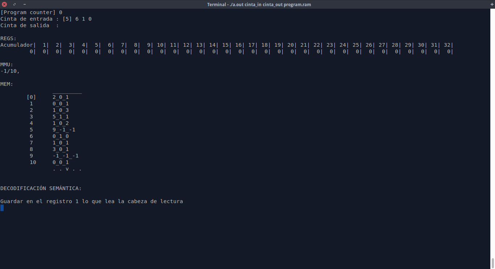

# Máquina RAM

Máquina de propósito general con juego de instrucciones reducido.

Implementa de forma adicional:
- **Compilador** de instrucciones en ensamblador a código máquina.  
La máquina virtual internamente trabaja con un lenguaje basado en
números enteros para un mayor rendimiento

  - *Modo verbose*
  - *Debugger*      


- Pseudo **MMU** para verificar los saltos
- Modo de ejcución paso a paso, muestra

  - *Registros*
  - *Cinta de entrada / salida*
  - *Instrucciones*
  - *Decodificación semántica de la instrucción*




---
## Compilar

```terminal
make
```

## Ejecutar

```terminal
./Ram fichero_cinta_entrada  fichero_cinta_salida  fichero_programa
```
---
## Instrucciones
- **LOAD** cargar en R0 un valor  

  ```
  LOAD = 3 → en R0 3  
  LOAD 3   → en R0 lo que haya en R3  
  LOAD *3  → en R0 el contenido de lo apuntado por R3
  ```

- **STORE** guarda el contenido de R0 en un reg

  ```
  STORE = 3 → inválido
  STORE 3   → lo que está en R0 se pone en R3
  STORE *3  → lo que está en R0 se almacena en la dir contenida en R3
  ```

- **READ** leer la cinta de entrada. _No se puede leer y volcar al acumulador_

  ```
  READ = 1 → inválido
  READ 1   → lo que lea la cabeza de lectura a R1
  READ *1  → lo que lea la cabeza de lectura a la dir cotnenida en R1
  ```

- **WRITE** escribir la cinta de salida

  ```
  WRITE = 1 → escribir 1 en dónde esté la cabeza de escritura
  WRITE 1   → lo que está en R1 se escribe en dónde esté la cabeza de escritura
  WRITE *1  → lo que esté en lo apuntado por R1 se escribe en la cinta de escritura
  ```

- **ADD**

  ```
  ADD = 1 → leo R0, le sumo 1 y lo devuelvo a R0
  ADD 1   → leo R0, le sumo el contenido de R1 y lo devuelvo a R0
  ADD *1  → leo R0, le sumo el contenido de lo apuntado por R1 y lo devuelvo a R0
  ```

- **SUB**, Ídem que el anterior

- **MUL**, Ídem que el anterior

- **DIV**, Ídem que el anterior  

- **JUMP**, _etiq_

  ```
    Salto a etiqueta directo
  ```

- **JGTZ**, _etiq_

  ```
    Salto a etiqueta si R0 > 0
  ```

- **JZERO**, _etiq_

  ```
    Salto a etiqueta si R0 = 0
  ```

- **HALT**, _control_

- **Comentarios**

  ```
  ADD = 1 ;esto es un comentario
  ```
---
## Sintaxis

De forma general conviene dejar un espacio entre cada elemento, sin embargo, el compilador
tratará de adaptarse en caso de que no existan.

**Etiquetas:**
- Tras una instrucción de salto (invocación del salto):  

`JUMP etiqueta1`

- Previas a cualquier una instrucción (destino al que se salta)

`etiqeta : INSTRUCCIÓN` ó `etiqueta: INSTRUCCIÓN`

**Instrucciones complejas** (__*__,**=**)

`ADD =1` ó `ADD = 1`

`WRITE =1` ó `WRITE = 1`
